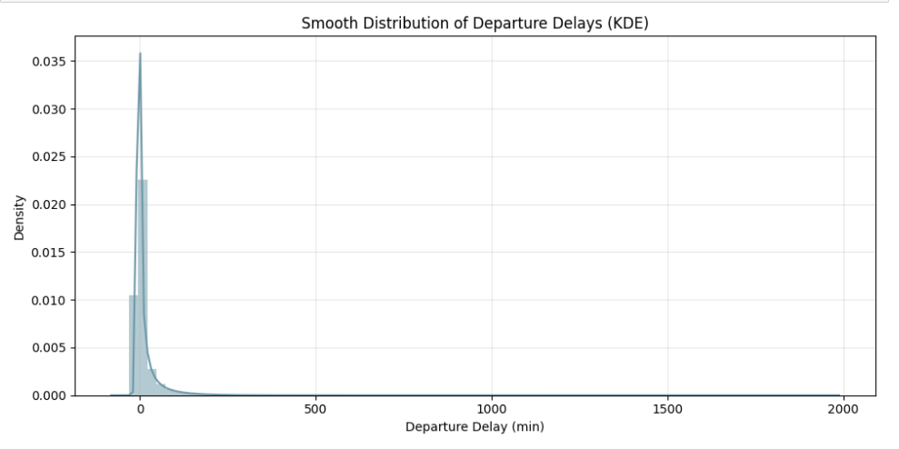
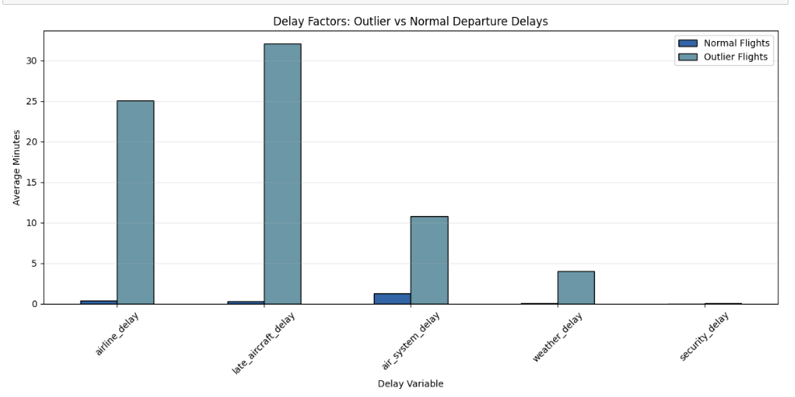
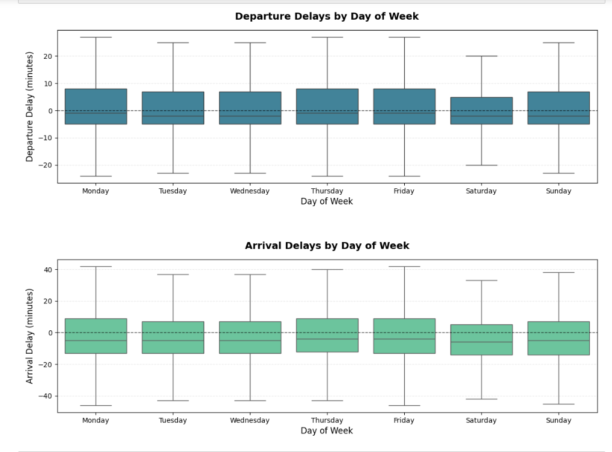
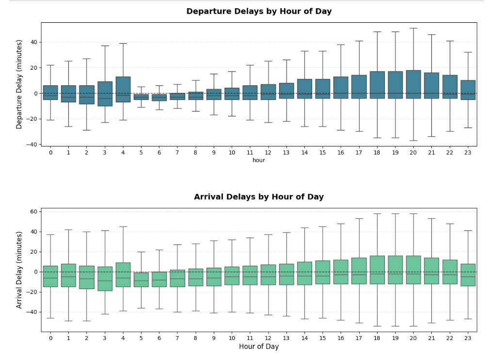
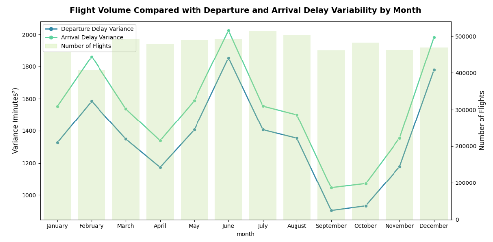
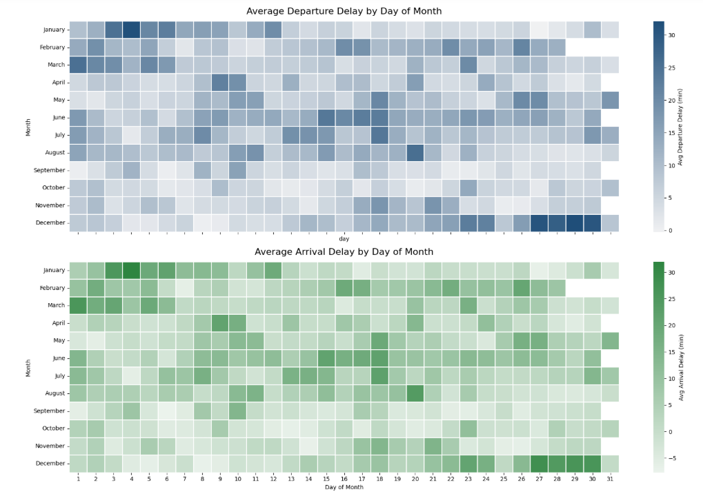
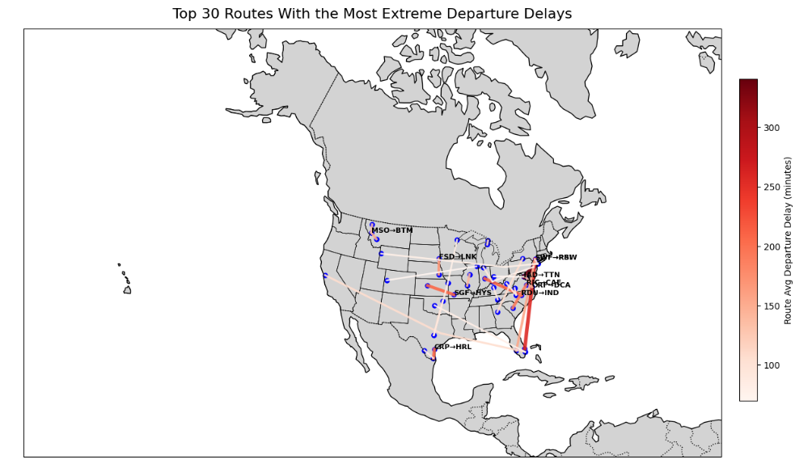
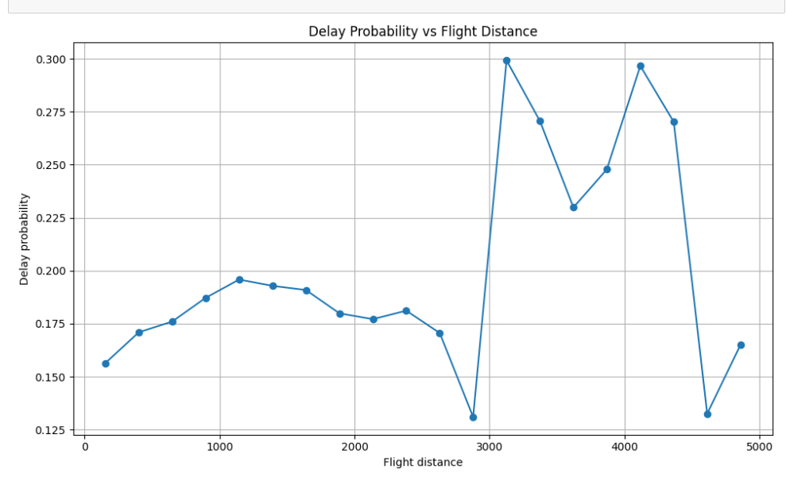

# FIAP Machine Learning Tech Challenge 3

Este projeto tem como objetivo aplicar técnicas de **modelagem supervisionada e não supervisionada** e desenvolver um **pipeline completo de ciência de dados**, abrangendo desde a exploração e preparação dos dados até a interpretação dos resultados e geração de insights acionáveis.

A análise utiliza dados reais de voos comerciais para investigar padrões de atraso, desempenho operacional de aeroportos e rotas, bem como fatores temporais e estruturais que influenciam a probabilidade de atrasos.

|  |
|:----------------------------------------------------------------:|

-----------------------------------

## Sumário

- [Descrição](#descrição)
- [Objetivos do Projeto](#objetivos-do-projeto)
- [Estrutura da Análise](#estrutura-da-análise)
- [Tecnologias Utilizadas](#tecnologias-utilizadas)
- [Licença e Autores](#licença-e-autores)

-----------------------------------

## Descrição

O projeto explora dados históricos de voos para compreender o comportamento dos atrasos de partida e chegada, considerando múltiplas dimensões operacionais, temporais e geográficas.  

A análise foca exclusivamente em **voos realizados (não cancelados e não desviados)**, permitindo avaliar atrasos como fenômenos operacionais e não como falhas totais do sistema.

São utilizadas técnicas de **análise exploratória de dados (EDA)**, engenharia de atributos e visualizações avançadas para identificar:

- Diferenças entre atrasos típicos e atrasos extremos  
- Efeitos de propagação de atrasos ao longo do dia  
- Variações sazonais e padrões temporais  
- Relações entre aeroportos, rotas e desempenho operacional  

Com base nesses insights, modelos de **aprendizado supervisionado** são desenvolvidos para estimar a probabilidade de um voo sofrer atraso, apoiando a tomada de decisão e o entendimento do risco operacional.

-----------------------------------

## Objetivos do Projeto

- Investigar os principais fatores que contribuem para atrasos de voos
- Comparar comportamentos de atraso ao longo do tempo (hora, dia da semana e sazonalidade)
- Identificar aeroportos e rotas com maior frequência e severidade de atrasos
- Analisar atrasos extremos e seus fatores determinantes
- Desenvolver modelos preditivos para estimar a probabilidade de atraso
- Interpretar os resultados de forma clara e orientada a negócio

-----------------------------------

## Estrutura da Análise

O pipeline de ciência de dados segue as seguintes etapas:

1. **Exploração e limpeza dos dados**
   - Tratamento de valores ausentes
   - Padronização de variáveis temporais
   - Remoção de atributos redundantes

2. **Análise exploratória**
   - Distribuição e variabilidade dos atrasos
   - Identificação de outliers
   - Análise temporal (hora, dia, mês)
   - Análise espacial por aeroportos e rotas

3. **Engenharia de atributos**
   - Criação de variáveis derivadas (atraso binário, horário, sazonalidade)
   - Agregações por aeroporto e rota

4. **Modelagem**
   - Modelos supervisionados para previsão de atraso
   - Avaliação de desempenho e interpretação dos resultados

5. **Conclusões e insights operacionais**
   - Identificação de padrões recorrentes
   - Implicações para gestão e planejamento operacional

-----------------------------------

## Tecnologias Utilizadas

- **Python 3.11**
- **Pandas** e **NumPy** — manipulação e análise de dados
- **Matplotlib** e **Seaborn** — visualização de dados
- **Scikit-learn** — modelagem e avaliação de modelos
- **Jupyter Notebook** — desenvolvimento e documentação da análise

-----------------------------------

## Resultados Principais / Key Findings

A análise exploratória e os modelos desenvolvidos revelaram padrões consistentes e relevantes sobre o comportamento dos atrasos de voos, tanto em situações rotineiras quanto em cenários de disrupção extrema.

### 1. Distribuição e Severidade dos Atrasos

*Figura 1 — Os atrasos nas partidas apresentam uma distribuição altamente assimétrica à direita, com a maioria dos voos próximos ao horário previsto e um pequeno número de valores extremos atípicos.*

- A maioria dos voos parte no horário ou com pequenos atrasos, indicando que o sistema opera de forma estável na maior parte do tempo.
- A distribuição dos atrasos é altamente assimétrica, com uma cauda longa à direita, onde poucos voos concentram atrasos extremamente elevados.
- Atrasos severos podem ultrapassar várias horas, mesmo em voos que não foram cancelados, evidenciando falhas operacionais significativas.

### 2. Fatores Determinantes de Atrasos Extremos

*Figura 2 — Atrasos extremos são predominantemente causados ​​por atrasos de aeronaves, companhias aéreas, sistemas aéreos e fatores relacionados ao clima.*

- Voos classificados como outliers apresentam forte associação com:
  - **Atraso da aeronave anterior (Late Aircraft Delay)**
  - **Problemas operacionais internos das companhias aéreas (Airline Delay)**
  - **Restrições do sistema aéreo (Air System Delay)**
  - **Condições meteorológicas adversas (Weather Delay)**
- Em contraste, voos com atrasos normais exibem contribuições baixas e equilibradas desses fatores, indicando que atrasos extremos não são aleatórios, mas resultado de múltiplas falhas acumuladas.

### 3. Padrões Temporais e Efeito Cascata

*Figura 3 — Os atrasos de partida e chegada mostram uma variação mínima ao longo dos dias da semana, indicando que os efeitos da programação em dias úteis têm pouca influência no comportamento geral dos atrasos.*

*Figura 4 — Já a variabilidade do atraso aumenta ao longo do dia, o que é consistente com interrupções operacionais em cascata.*

- O dia da semana exerce pouca influência sobre o comportamento dos atrasos.
- O horário do dia, por outro lado, é um fator crítico: atrasos e sua variabilidade aumentam progressivamente ao longo do dia.
- Esse comportamento reflete o **efeito cascata operacional**, no qual atrasos iniciais se propagam ao longo das rotações de aeronaves, escalas de tripulação e congestionamento aeroportuário.

### 4. Sazonalidade e Variabilidade Anual

*Figura 5 — Apesar da consistência no número de voos mensais, a variação nos atrasos apresenta flutuações sazonais acentuadas, refletindo períodos de maior estresse operacional.*

*Figura 6 — A variabilidade dos atrasos atinge o pico durante os períodos de férias e verão, apesar dos volumes de voos relativamente estáveis.*

- O volume de voos permanece relativamente estável ao longo do ano, indicando que variações de atraso não são explicadas apenas pela quantidade de operações.
- Picos de variabilidade de atraso coincidem com períodos de alta demanda e maior risco operacional, como:
  - Final de dezembro e início de janeiro (feriados e inverno)
  - Meses de verão, associados a alta demanda e eventos climáticos severos
- Esses períodos apresentam maior instabilidade operacional, mesmo sem aumento significativo no número de voos.

### 5. Aeroportos, Rotas e Estrutura da Rede

*Figura 7 — A maioria das rotas herda o comportamento de atraso típico dos aeroportos, mas várias rotas apresentam atrasos desproporcionalmente altos.*

- A operação aérea é altamente concentrada em poucos aeroportos hub, enquanto a maioria dos aeroportos opera com baixo volume de voos.
- Não foi observada uma relação direta entre volume de voos e nível médio de atraso: aeroportos grandes não são necessariamente os mais ineficientes.
- A maioria das rotas herda o comportamento de atraso de seus aeroportos de origem e destino.
- Algumas rotas específicas apresentam atrasos significativamente superiores ao esperado, sugerindo restrições locais ou problemas recorrentes.

### 6. Distância do Voo e Probabilidade de Atraso

*Figura 8 — A probabilidade de atraso aumenta de 10–20% para quase 30% em voos entre 3.000 e 4.000 milhas.*

- A probabilidade de atraso aumenta gradualmente com a distância do voo.
- Voos de curta e média distância apresentam taxas de atraso relativamente estáveis, entre **10% e 20%**.
- Em voos de longa distância, especialmente entre **3.000 e 4.000 milhas**, a taxa de atraso se aproxima de **30%**.
- A distância não é a causa direta do atraso, mas atua como um **indicador de risco acumulado**, refletindo maior exposição a congestionamento aéreo, condições meteorológicas e propagação de atrasos ao longo da operação.

### 7. Implicações para Modelagem Preditiva
- Atrasos são fortemente influenciados por fatores temporais e operacionais, tornando modelos baseados apenas em características estáticas insuficientes.
- Variáveis relacionadas ao horário, histórico operacional e contexto da rota são essenciais para capturar o risco de atraso.
- A distinção entre atrasos típicos e extremos é fundamental para melhorar a interpretação e a robustez dos modelos preditivos.

-----------------------------------

## Licença e Autores

Projeto desenvolvido como parte do **FIAP – Machine Learning Tech Challenge 3**.

### 🧑‍💻 Desenvolvido por

- `Beatriz Rosa Carneiro Gomes - RM365967`
- `Cristine Scheibler - RM365433`
- `Guilherme Fernandes Dellatin - RM365508`
- `Iana Alexandre Neri - RM360484`
- `João Lucas Oliveira Hilario - RM366185`