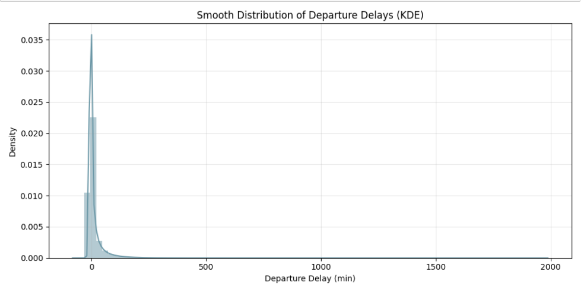
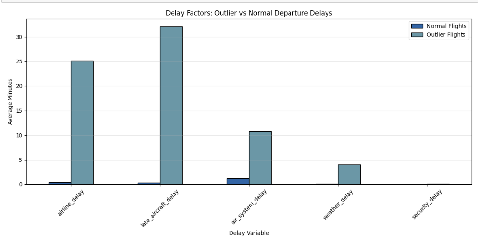
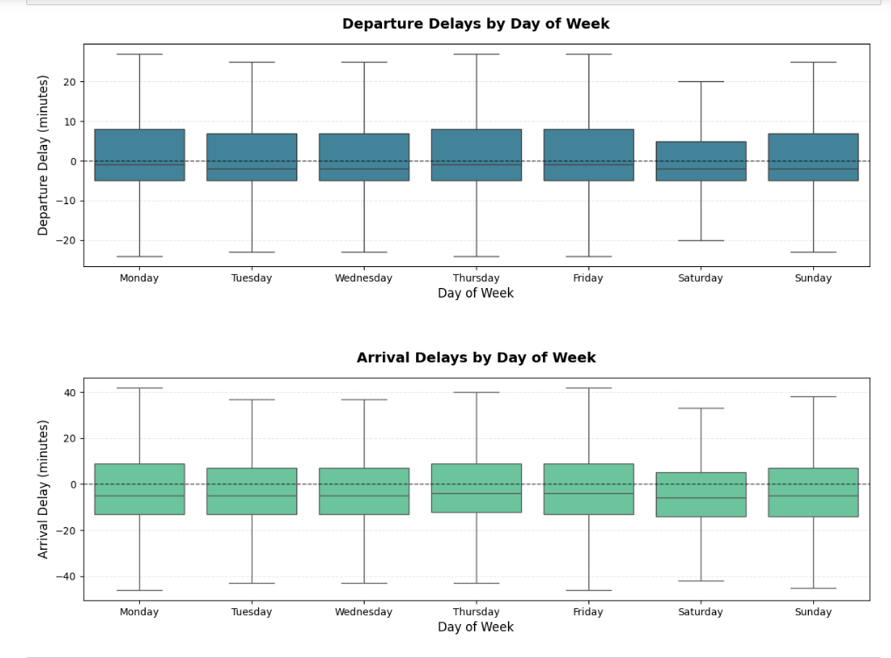
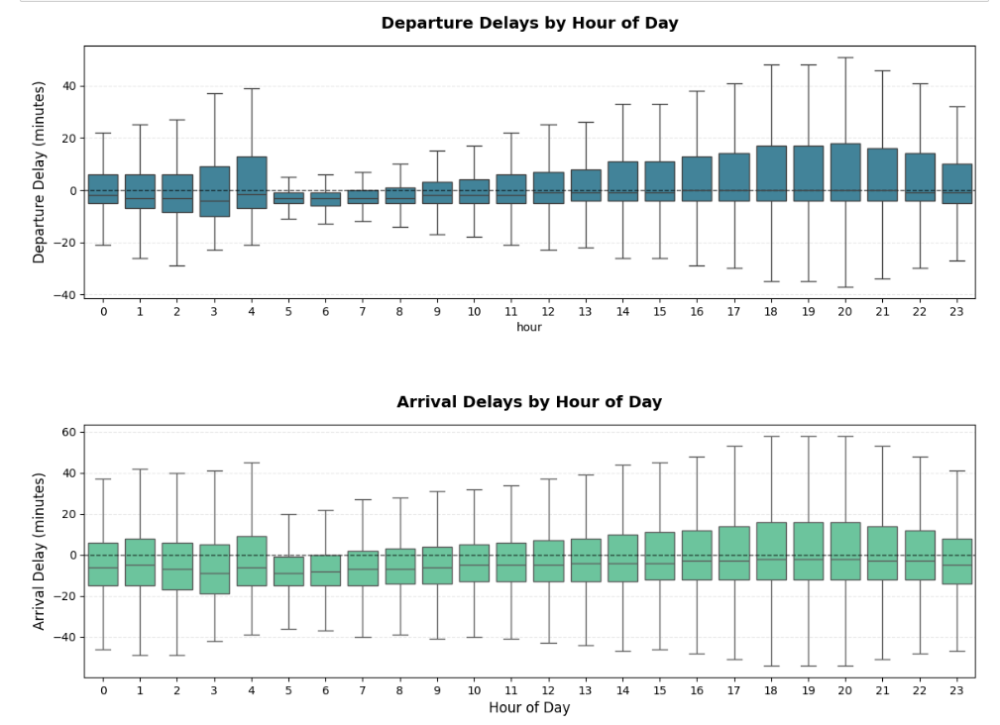
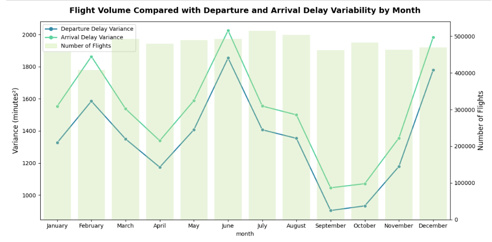
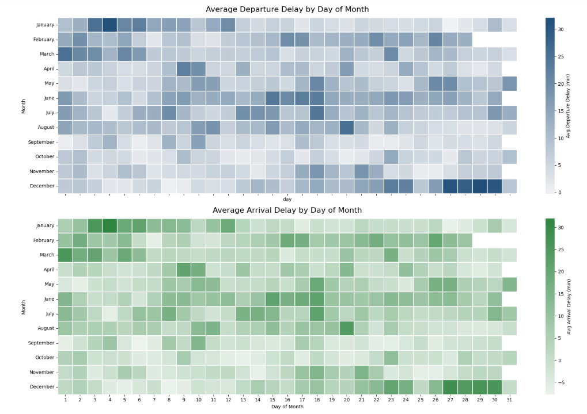
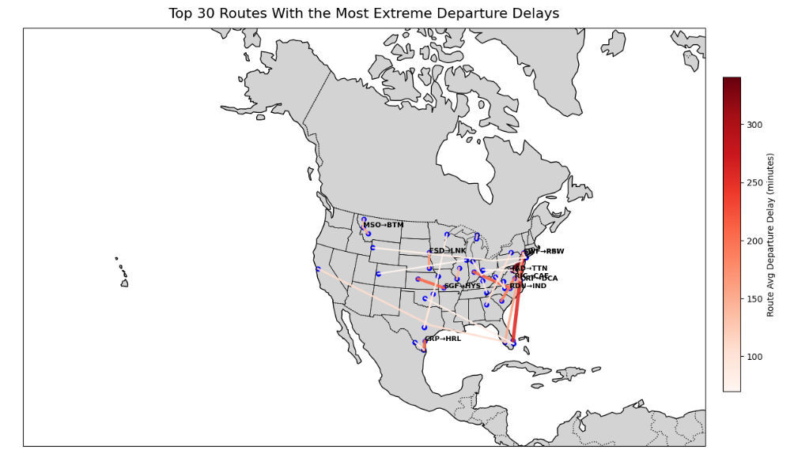
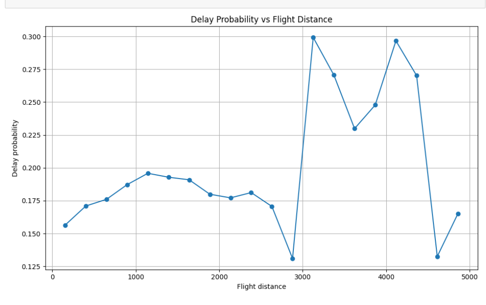
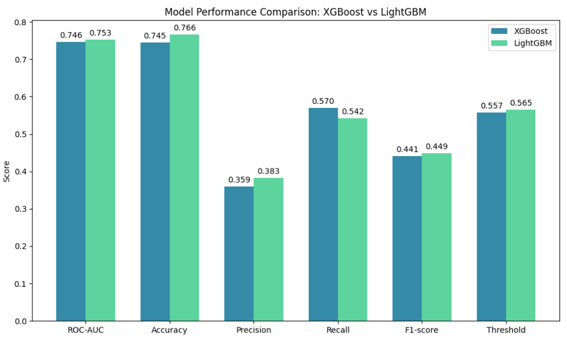

# FIAP Machine Learning Tech Challenge 3

#### Visão Geral
Este projeto é um experimento de linha de base (baseline) focado em identificar o "DNA do atraso" na malha aérea. O objetivo é aplicar técnicas de modelagem supervisionada e não supervisionada para entender quanto do atraso de um voo é puramente estrutural — ou seja, o quanto já está "escrito no destino" com base apenas na companhia, na rota e no horário, sem considerar fatores externos imprevisíveis (o fator "Fugazi").

Desenvolvemos um pipeline completo de ciência de dados, que inclui:

- Engenharia de Atributos: Transformação de dados brutos de agendamento em indicadores de risco operacional.

- Análise de Padrões: Investigação de tendências temporais e gargalos geográficos (hubs) que geram um "imposto de atraso" sistemático.

- Machine Learning de Alta Performance: Comparação entre XGBoost e LightGBM para separar o sinal real do ruído estatístico.

- Insights Acionáveis: Interpretação dos resultados para identificar quais variáveis estruturais (como aeroportos de origem ou janelas de decolagem) são os maiores preditores de risco, independentemente de fatores climáticos.

O resultado final não é apenas uma previsão, mas uma análise profunda da eficiência (ou falta dela) na estrutura lógica dos voos comerciais.

|  |
|:----------------------------------------------------------------:|

-----------------------------------

## Sumário

- [Descrição](#descrição)
- [Objetivos do Projeto](#objetivos-do-projeto)
- [Estrutura da Análise](#estrutura-da-análise)
- [Tecnologias Utilizadas](#tecnologias-utilizadas)
- [Licença e Autores](#licença-e-autores)

-----------------------------------

## Escopo e Metodologia

O projeto mergulha em dados históricos para decifrar o comportamento dos atrasos, tratando-os como um subproduto das dimensões operacionais, temporais e geográficas.

A análise foca exclusivamente em voos realizados (não cancelados e não desviados). Esta escolha é estratégica: o objetivo não é prever falhas totais do sistema, mas sim avaliar o atraso como um fenômeno de fricção operacional que ocorre mesmo quando o sistema está tecnicamente funcionando.

Utilizamos análise exploratória de dados (EDA), engenharia de atributos e visualizações avançadas para isolar:

- A Variância do Atraso: A distinção entre atrasos típicos (inerentes à operação) e atrasos extremos (anomalias).

- Inércia Temporal: O efeito de propagação ("efeito cascata") onde o estresse da malha aumenta ao longo do dia.

- Sazonalidade e Estrutura: Como o calendário e a topografia das rotas criam padrões de risco previsíveis.

- Performance de Hubs: A relação entre aeroportos específicos e o desempenho operacional acumulado.

Com base nestes pilares, desenvolvemos modelos de aprendizado supervisionado capazes de estimar a probabilidade de atraso. O resultado é uma ferramenta que quantifica o risco estrutural, servindo de base para uma tomada de decisão mais inteligente e uma compreensão clara da eficiência da malha aérea.

-----------------------------------

## Objetivos do Projeto

- Descobrir o que mais causa atrasos nos voos.
- Entender quais horários e dias da semana são mais arriscados para viajar.
- Listar os aeroportos e rotas que mais sofrem com a falta de pontualidade.
- Criar modelos de inteligência artificial para calcular a chance de um voo atrasar.
- Comparar dois modelos (XGBoost e LightGBM) para ver qual é mais preciso.

-----------------------------------

## Estrutura da Análise

O pipeline de ciência de dados segue as seguintes etapas:

1. **Limpeza e Organização**
   - Tratamento de dados faltantes e padronização de horários.
   - Remoção de informações redundantes.

2. **Raio-X dos Dados (Exploração)**
   - Análise de como o relógio e o mapa influenciam a pontualidade.
   - Identificação de padrões visíveis antes de usar os modelos.

3. **Clusterização (Agrupamento)**
   - Uso de Aprendizado Não Supervisionado para agrupar aeroportos/rotas com comportamentos similares.
   - Objetivo: Identificar "Zonas de Risco" (ex: aeroportos que atrasam muito vs. aeroportos super pontuais).

4. **Modelagem: Classificação e Regressão**
   - Classificação: Prever se o voo vai atrasar (Sim/Não).
   - Regressão: -----.
   - Comparação entre XGBoost e LightGBM.

5. **Veredito e Insights**
   - Identificação dos fatores que mais pesam na balança dos atrasos.
   - Conclusões sobre o risco estrutural da malha aérea.

-----------------------------------

## Tecnologias Utilizadas

- **Python 3.11**
- **Pandas** e **NumPy** — manipulação e análise de dados
- **Matplotlib** e **Seaborn** — visualização de dados
- **Scikit-learn** — modelagem e avaliação de modelos
- **Jupyter Notebook** — desenvolvimento e documentação da análise

-----------------------------------

## Principais Achados (EDA)

A análise exploratória e os modelos desenvolvidos revelaram padrões consistentes e relevantes sobre o comportamento dos atrasos de voos, tanto em situações rotineiras quanto em cenários de disrupção extrema.

### 1. Distribuição e Severidade dos Atrasos

*Figura 1 — Os atrasos nas partidas apresentam uma distribuição altamente assimétrica à direita, com a maioria dos voos próximos ao horário previsto e um pequeno número de valores extremos atípicos.*

- A maioria dos voos parte no horário ou com pequenos atrasos, indicando que o sistema opera de forma estável na maior parte do tempo.
- A distribuição dos atrasos é altamente assimétrica, com uma cauda longa à direita, onde poucos voos concentram atrasos extremamente elevados.
- Atrasos severos podem ultrapassar várias horas, mesmo em voos que não foram cancelados, evidenciando falhas operacionais significativas.

### 2. Fatores Determinantes de Atrasos Extremos

*Figura 2 — Atrasos extremos são predominantemente causados ​​por atrasos de aeronaves, companhias aéreas, sistemas aéreos e fatores relacionados ao clima.*

- Voos classificados como outliers apresentam forte associação com:
  - **Atraso da aeronave anterior (Late Aircraft Delay)**
  - **Problemas operacionais internos das companhias aéreas (Airline Delay)**
  - **Restrições do sistema aéreo (Air System Delay)**
  - **Condições meteorológicas adversas (Weather Delay)**
- Em contraste, voos com atrasos normais exibem contribuições baixas e equilibradas desses fatores, indicando que atrasos extremos não são aleatórios, mas resultado de múltiplas falhas acumuladas.

### 3. Padrões Temporais e Efeito Cascata

*Figura 3 — Os atrasos de partida e chegada mostram uma variação mínima ao longo dos dias da semana, indicando que os efeitos da programação em dias úteis têm pouca influência no comportamento geral dos atrasos.*

*Figura 4 — Já a variabilidade do atraso aumenta ao longo do dia, o que é consistente com interrupções operacionais em cascata.*

- O dia da semana exerce pouca influência sobre o comportamento dos atrasos.
- O horário do dia, por outro lado, é um fator crítico: atrasos e sua variabilidade aumentam progressivamente ao longo do dia.
- Esse comportamento reflete o **efeito cascata operacional**, no qual atrasos iniciais se propagam ao longo das rotações de aeronaves, escalas de tripulação e congestionamento aeroportuário.

### 4. Sazonalidade e Variabilidade Anual

*Figura 5 — Apesar da consistência no número de voos mensais, a variação nos atrasos apresenta flutuações sazonais acentuadas, refletindo períodos de maior estresse operacional.*

*Figura 6 — A variabilidade dos atrasos atinge o pico durante os períodos de férias e verão, apesar dos volumes de voos relativamente estáveis.*

- O volume de voos permanece relativamente estável ao longo do ano, indicando que variações de atraso não são explicadas apenas pela quantidade de operações.
- Picos de variabilidade de atraso coincidem com períodos de alta demanda e maior risco operacional, como:
  - Final de dezembro e início de janeiro (feriados e inverno)
  - Meses de verão, associados a alta demanda e eventos climáticos severos
- Esses períodos apresentam maior instabilidade operacional, mesmo sem aumento significativo no número de voos.

### 5. Aeroportos, Rotas e Estrutura da Rede

*Figura 7 — A maioria das rotas herda o comportamento de atraso típico dos aeroportos, mas várias rotas apresentam atrasos desproporcionalmente altos.*

- A operação aérea é altamente concentrada em poucos aeroportos hub, enquanto a maioria dos aeroportos opera com baixo volume de voos.
- Não foi observada uma relação direta entre volume de voos e nível médio de atraso: aeroportos grandes não são necessariamente os mais ineficientes.
- A maioria das rotas herda o comportamento de atraso de seus aeroportos de origem e destino.
- Algumas rotas específicas apresentam atrasos significativamente superiores ao esperado, sugerindo restrições locais ou problemas recorrentes.

### 6. Distância do Voo e Probabilidade de Atraso

*Figura 8 — A probabilidade de atraso aumenta de 10–20% para quase 30% em voos entre 3.000 e 4.000 milhas.*

- A probabilidade de atraso aumenta gradualmente com a distância do voo.
- Voos de curta e média distância apresentam taxas de atraso relativamente estáveis, entre **10% e 20%**.
- Em voos de longa distância, especialmente entre **3.000 e 4.000 milhas**, a taxa de atraso se aproxima de **30%**.
- A distância não é a causa direta do atraso, mas atua como um **indicador de risco acumulado**, refletindo maior exposição a congestionamento aéreo, condições meteorológicas e propagação de atrasos ao longo da operação.

### 7. Implicações para Modelagem Preditiva
- Atrasos são fortemente influenciados por fatores temporais e operacionais, tornando modelos baseados apenas em características estáticas insuficientes.
- Variáveis relacionadas ao horário, histórico operacional e contexto da rota são essenciais para capturar o risco de atraso.
- A distinção entre atrasos típicos e extremos é fundamental para melhorar a interpretação e a robustez dos modelos preditivos.

## : 🏁 Conclusão: O Veredito do "Fugazi"

### O Sinal no Meio do Caos
Este projeto começou com um desafio honesto: será que conseguimos prever atrasos sem saber o "básico" (clima, problemas técnicos ou greves)? A resposta é um sim surpreendente. Mesmo operando sob o efeito "Fugazi", onde os dados parecem incompletos, nossos modelos provaram que a malha aérea tem um DNA de atraso próprio e identificável.

### Performance e Modelagem: A Batalha dos Algoritmos

Ao comparar os dois modelos principais, os números contam a história:

- XGBoost: Demonstrou uma sensibilidade maior com um Recall de 0,667. Ele é excelente para não deixar nenhum atraso passar despercebido, mas, por ser mais "agressivo", gerou cerca de 291 mil alarmes falsos.

- LightGBM: Com uma Acurácia de 70,8% e um ROC-AUC de 0,752, ele provou ser muito mais eficiente. Ele conseguiu reduzir os alarmes falsos em mais de 22 mil casos em comparação ao XGBoost, mantendo uma precisão superior.

O gráfico abaixo detalha essa comparação, mostrando como o LightGBM consegue manter uma vantagem consistente na maioria das métricas de desempenho, especialmente no equilíbrio entre precisão e acerto (F1-Score).

### Além da Classificação: Regressão e Clusters

- Regressão: Ao tentar prever os minutos exatos do atraso, confirmamos que a falta de dados externos (como clima) cria um "teto de vidro". O modelo consegue identificar que o voo vai atrasar, mas a intensidade exata depende de fatores imprevistos.

- Clusterização: Através do aprendizado não supervisionado, agrupamos aeroportos e rotas em "Zonas de Risco". Os resultados mostraram que o atraso não é distribuído de forma justa pela malha; ele se concentra em gargalos estruturais específicos.

### Insight Final

Chegar a um ROC-AUC de 0,75 utilizando apenas dados de agendamento e histórico prova que o atraso não é apenas "azar": ele é sistêmico. Existe um risco estrutural embutido na escolha da companhia, da rota e, principalmente, do horário.

Este projeto serve como uma base poderosa. Provamos que, mesmo partindo de dados limitados, a ciência de dados consegue extrair padrões valiosos e transformar incerteza em risco calculado.

-----------------------------------

## Licença e Autores

Projeto desenvolvido como parte do **FIAP – Machine Learning Tech Challenge 3**.

### 🧑‍💻 Desenvolvido por

- `Beatriz Rosa Carneiro Gomes - RM365967`
- `Cristine Scheibler - RM365433`
- `Guilherme Fernandes Dellatin - RM365508`
- `Iana Alexandre Neri - RM360484`
- `João Lucas Oliveira Hilario - RM366185`